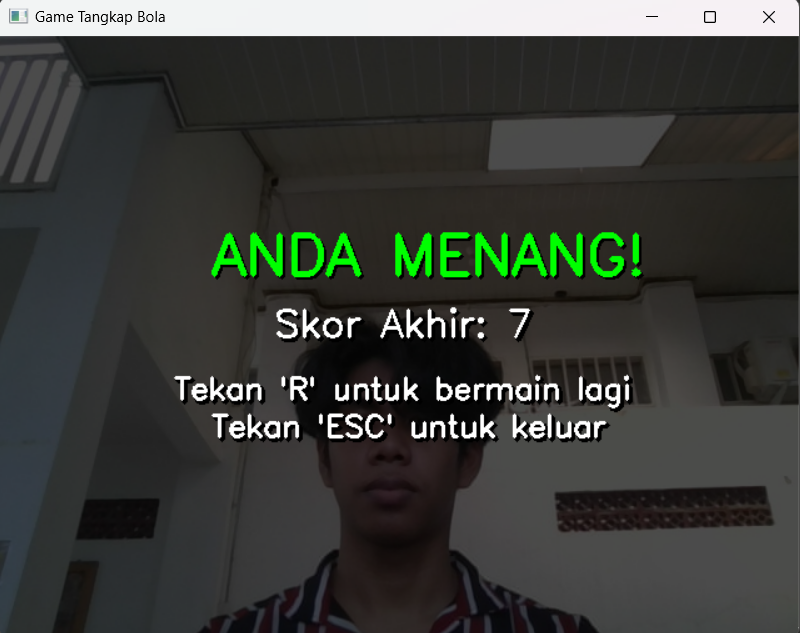

# 🎯 Simulasi Interaktif Penangkapan Objek Virtual dengan Face Tracking

<div align="center">
  
  <h3>Game interaktif berbasis computer vision untuk menangkap bola virtual menggunakan gerakan kepala</h3>
  
  
  
  
  
</div>

---
| Minggu   |  Kegiatan |
| :-----   |    ---:   |
|    1     |  UI / UX  |
|    2     |   Logic   |

---

## 📋 Deskripsi Proyek

Game **Simulasi Interaktif Penangkapan Objek Virtual** adalah aplikasi berbasis Python yang menggunakan teknologi computer vision untuk mendeteksi gerakan wajah pemain sebagai kontrol utama dalam permainan. Pemain harus menangkap bola virtual dengan warna tertentu menggunakan gerakan kepala yang dideteksi melalui kamera.

### ✨ Fitur Utama
- 🎮 **Face Tracking Real-time** - Menggunakan MediaPipe untuk deteksi wajah
- 🎨 **Multi-color Ball System** - 4 warna bola berbeda (Merah, Biru, Hijau, Kuning)
- ⏱️ **Dynamic Difficulty** - Kecepatan bola meningkat seiring waktu
- 🎯 **Score System** - Sistem poin berdasarkan bola yang berhasil ditangkap
- 🖼️ **Rich Graphics** - Antarmuka visual yang menarik dengan gambar PNG
- 🎵 **Interactive Menu** - Menu lobby untuk pemilihan warna bola

---

## 🖼️ Screenshot Game

<table>
  <tr>
    <td align="center">
      
      <br><b>🏠 Home Screen</b>
    </td>
    <td align="center">
      
      <br><b>🎯 Lobby Selection</b>
    </td>
  </tr>
  <tr>
    <td align="center">
      
      <br><b>🎮 Gameplay</b>
    </td>
    <td align="center">
      
      <br><b>👤 Player Testing</b>
    </td>
  </tr>
  <tr>
    <td align="center">
      
      <br><b>🏆 Victory Screen</b>
    </td>
    <td align="center">
      
      <br><b>💀 Game Over Screen</b>
    </td>
  </tr>
</table>

---

## 🔧 Persyaratan Sistem

### Hardware Requirements
- **Kamera/Webcam** yang berfungsi
- **RAM**: Minimal 4GB
- **Processor**: Intel i3 atau AMD equivalent
- **Storage**: 500MB ruang kosong

### Software Requirements
- **Python**: 3.7 atau lebih baru
- **Operating System**: Windows 10/11, macOS, atau Linux
- **Webcam Driver** yang terinstall dengan baik

---

## 📦 Instalasi dan Setup

### 1. Clone Repository

```html
<div style="background-color: #f6f8fa; padding: 16px; border-radius: 6px; border-left: 4px solid #0366d6;">
<strong>🔗 Clone dari GitHub:</strong>
</div>
```

```bash
# Clone repository
git clone https://github.com/machzaul/Simulasi-Interaktif-Penangkapan-Objek-Virtual-dengan-tracking-bagian-tubuh.git

# Masuk ke direktori proyek
cd Simulasi-Interaktif-Penangkapan-Objek-Virtual-dengan-tracking-bagian-tubuh
```

### 2. Persiapan Environment

```html
<div style="background-color: #fff3cd; padding: 16px; border-radius: 6px; border-left: 4px solid #ffc107;">
<strong>⚠️ Penting:</strong> Disarankan menggunakan virtual environment untuk menghindari konflik dependencies.
</div>
```

```bash
# Buat virtual environment (opsional tapi disarankan)
python -m venv game_env

# Aktifkan virtual environment
# Windows:
game_env\Scripts\activate
# macOS/Linux:
source game_env/bin/activate
```

### 3. Install Dependencies

```html
<div style="background-color: #d1ecf1; padding: 16px; border-radius: 6px; border-left: 4px solid #bee5eb;">
<strong>📚 Install semua dependencies yang diperlukan:</strong>
</div>
```

```bash
# Install dependencies utama
pip install opencv-python
pip install mediapipe
pip install numpy

# Atau install semua sekaligus (jika ada requirements.txt)
pip install -r requirements.txt
```

#### Manual Installation (jika ada masalah):
```bash
# OpenCV untuk computer vision
pip install opencv-python==4.8.1.78

# MediaPipe untuk face detection
pip install mediapipe==0.10.7

# NumPy untuk array processing
pip install numpy==1.24.3
```

### 4. Persiapan Assets

Pastikan struktur folder dan file gambar berikut ada dalam direktori proyek:

```
📁 Simulasi-Interaktif-Penangkapan-Objek-Virtual/
│
├── 📄 main.py (file utama game)
├── 📄 README.md
│
├── 🖼️ keranjang.png (gambar keranjang)
├── 🖼️ bolabiru.png (gambar bola biru)
├── 🖼️ bolakuning.png (gambar bola kuning)
├── 🖼️ bolahijau.png (gambar bola hijau)
├── 🖼️ bolamerah.png (gambar bola merah)
│
└── 📁 gameplay/
    ├── 🖼️ home.png
    ├── 🖼️ loby.png
    ├── 🖼️ gameplay.png
    ├── 🖼️ pengujianplayer.png
    ├── 🖼️ menang.png
    └── 🖼️ gameover.png
```

---

## 🚀 Cara Menjalankan Game

### Quick Start

```html
<div style="background-color: #d4edda; padding: 16px; border-radius: 6px; border-left: 4px solid #28a745;">
<strong>🎮 Jalankan Game:</strong>
</div>
```

```bash
# Pastikan berada di direktori proyek
cd Simulasi-Interaktif-Penangkapan-Objek-Virtual-dengan-tracking-bagian-tubuh

# Jalankan game
python main.py
```

### Troubleshooting Launch Issues

```html
<div style="background-color: #f8d7da; padding: 16px; border-radius: 6px; border-left: 4px solid #dc3545;">
<strong>🔍 Jika mengalami error:</strong>
</div>
```

1. **Kamera tidak terdeteksi:**
   ```bash
   # Cek apakah kamera tersedia
   python -c "import cv2; print('Kamera OK' if cv2.VideoCapture(0).isOpened() else 'Kamera Error')"
   ```

2. **File gambar tidak ditemukan:**
   - Pastikan semua file `.png` ada di direktori yang sama dengan `main.py`
   - Download assets yang hilang dari repository

3. **ModuleNotFoundError:**
   ```bash
   # Install ulang dependencies
   pip install --upgrade opencv-python mediapipe numpy
   ```

---

## 🎮 Cara Bermain

### 🏁 Langkah-langkah Bermain:

1. **Mulai Game**
   - Jalankan `python main.py`
   - Tekan **Enter** di layar home untuk lanjut

2. **Pilih Warna Bola**
   - Di layar lobby, arahkan kepala ke salah satu bola warna
   - Tahan posisi selama 2 detik untuk memilih

3. **Gameplay**
   - Gerakkan kepala untuk mengontrol keranjang
   - Tangkap hanya bola dengan warna yang dipilih
   - Hindari bola dengan warna lain (akan game over)
   - Bertahan selama 60 detik untuk menang

### ⌨️ Kontrol Game:

| Tombol | Fungsi |
|--------|--------|
| **Enter** | Mulai game dari home screen |
| **ESC** | Keluar dari game |
| **R** | Restart game (di layar game over) |
| **Gerakan Kepala** | Mengontrol keranjang penangkap |

### 🎯 Sistem Scoring:

- ✅ **+1 Poin**: Menangkap bola dengan warna yang benar
- ❌ **Game Over**: Menangkap bola dengan warna yang salah
- 🏆 **Menang**: Bertahan selama 60 detik
- ⚡ **Difficulty**: Kecepatan bola meningkat setiap 10 detik

---

## 🧩 Arsitektur Code

### Struktur Utama:

```python
# Core Components
├── Face Detection (MediaPipe)
├── Game Logic (Collision Detection, Scoring)
├── Ball Management (Spawning, Movement)
├── UI Rendering (Screens, HUD)
└── Input Handling (Keyboard, Face Tracking)
```

### Key Functions:

- `create_ball()` - Membuat bola baru dengan posisi aman
- `draw_lobby_screen()` - Layar pemilihan warna bola
- `draw_game_ui()` - Interface game utama
- `get_current_speed_range()` - Dynamic difficulty scaling
- `check_ball_collision()` - Deteksi tabrakan antar objek

---

## 🔧 Kustomisasi

### Mengubah Pengaturan Game:

```python
# Di bagian atas main.py, ubah variabel berikut:

# Durasi game (dalam detik)
total_game_time = 60  # ubah sesuai keinginan

# Kecepatan dasar bola
BASE_SPEED_MIN = 3    # kecepatan minimum
BASE_SPEED_MAX = 6    # kecepatan maksimum

# Jarak minimum antar bola
MIN_BALL_DISTANCE = 120  # pixel

# Durasi pemilihan di lobby
selection_duration = 2.0  # detik
```

### Menambah Warna Bola Baru:

```python
# Tambahkan di dictionary ball_images
ball_images = {
    (255, 0, 0): cv2.imread('bolabiru.png', cv2.IMREAD_UNCHANGED),
    (0, 255, 255): cv2.imread('bolakuning.png', cv2.IMREAD_UNCHANGED),
    (0, 255, 0): cv2.imread('bolahijau.png', cv2.IMREAD_UNCHANGED),
    (0, 0, 255): cv2.imread('bolamerah.png', cv2.IMREAD_UNCHANGED),
    # Tambahkan warna baru:
    (128, 0, 128): cv2.imread('bolaungu.png', cv2.IMREAD_UNCHANGED),
}
```

---

## 🐛 Troubleshooting

### Masalah Umum dan Solusi:

```html
<table style="border-collapse: collapse; width: 100%;">
<tr style="background-color: #f8f9fa;">
<th style="border: 1px solid #dee2e6; padding: 12px;">❌ Masalah</th>
<th style="border: 1px solid #dee2e6; padding: 12px;">✅ Solusi</th>
</tr>
```

| ❌ Masalah | ✅ Solusi |
|------------|-----------|
| Kamera tidak muncul | Cek permission kamera, tutup aplikasi lain yang menggunakan kamera |
| Face tracking tidak akurat | Pastikan pencahayaan cukup, wajah menghadap kamera |
| Game lag/patah-patah | Tutup aplikasi lain, kurangi resolusi kamera |
| File gambar tidak muncul | Cek path file, pastikan format PNG dengan transparency |
| Error saat install MediaPipe | Update pip: `pip install --upgrade pip` |

</table>
```

### Performance Optimization:

```python
# Untuk komputer dengan spek rendah, ubah:
# Resolusi kamera lebih kecil
cap.set(cv2.CAP_PROP_FRAME_WIDTH, 640)
cap.set(cv2.CAP_PROP_FRAME_HEIGHT, 480)

# Kurangi confidence threshold untuk deteksi lebih cepat
face_mesh = mp_face_mesh.FaceMesh(
    min_detection_confidence=0.3,  # turunkan dari 0.5
    min_tracking_confidence=0.3     # turunkan dari 0.5
)
```

---

## 🤝 Kontribusi

Kami menyambut kontribusi dari developer lain! Berikut cara berkontribusi:

### Langkah Kontribusi:

1. **Fork** repository ini
2. **Clone** fork Anda ke lokal
3. Buat **branch** baru untuk fitur: `git checkout -b fitur-baru`
4. **Commit** perubahan: `git commit -m 'Tambah fitur baru'`
5. **Push** ke branch: `git push origin fitur-baru`
6. Buat **Pull Request**

### Ide Pengembangan:

-  Tambah sound effects
-  Sistem leaderboard
-  More ball colors dan effects
-  Mobile version
-  Multiplayer mode
-  AI difficulty adjustment

---

## 📄 Lisensi

<div style="background-color: #e7f3ff; padding: 16px; border-radius: 6px; border-left: 4px solid #2196f3;">
<strong>📜 Informasi Lisensi:</strong>
</div>
```

Proyek ini dilisensikan di bawah **MIT License**. Lihat file `LICENSE` untuk detail lengkap.

```
MIT License

Copyright (c) 2024 machzaul

Permission is hereby granted, free of charge, to any person obtaining a copy
of this software and associated documentation files (the "Software"), to deal
in the Software without restriction, including without limitation the rights
to use, copy, modify, merge, publish, distribute, sublicense, and/or sell
copies of the Software, and to permit persons to whom the Software is
furnished to do so, subject to the following conditions:

The above copyright notice and this permission notice shall be included in all
copies or substantial portions of the Software.
```

---

## 👨‍💻 Pengembang

<div align="center">
  <h3>🚀 Dikembangkan oleh:</h3>
  <a href="https://github.com/deborasihombing">
    
  </a>
  <a href="https://github.com/machzaul">
    
  </a>
  <a href="https://github.com/putri1313">
    
  </a>

</div>
```

### 📞 Kontak:
- 📧 Email: [Hubungi melalui GitHub](https://github.com/machzaul)
- 🐛 Issues: [Report Bug](https://github.com/machzaul/Simulasi-Interaktif-Penangkapan-Objek-Virtual-dengan-tracking-bagian-tubuh/issues)
- 💡 Feature Request: [Request Feature](https://github.com/machzaul/Simulasi-Interaktif-Penangkapan-Objek-Virtual-dengan-tracking-bagian-tubuh/issues)

---

## 🙏 Acknowledgments

Terima kasih kepada:
- **MediaPipe Team** - Untuk library face detection yang luar biasa
- **OpenCV Community** - Untuk tools computer vision yang powerful  
- **Python Community** - Untuk ecosystem yang mendukung
- **Contributors** - Yang telah membantu pengembangan proyek ini

---

<div align="center">
  <h3>⭐ Jika proyek ini membantu, jangan lupa beri star! ⭐</h3>
  <a href="https://github.com/machzaul/Simulasi-Interaktif-Penangkapan-Objek-Virtual-dengan-tracking-bagian-tubuh">
    
  </a>
</div>
```

---

<div align="center">
  <sub>Built with 🐍 Python | 👁️ Computer Vision | 🎮 Gaming</sub>
</div>
